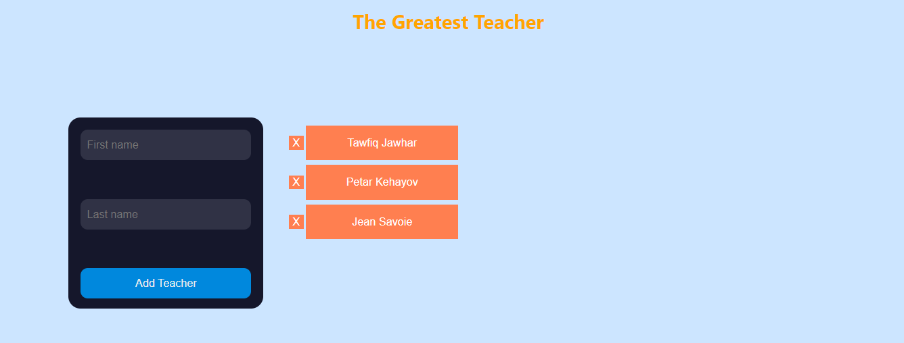

# The Greatest Teacher

## Project Description

### Application's purpose
The Greatest Teacher application provides an easy way to rate teachers and view their performances. The UI provides a list of teachers and a form to add teachers. A teacher can be deleted with the X button on its left. When a teacher gets clicked, a list of their courses appears. A form to add a course to the specific teacher also gets displayed. When a course gets clicked, a form to add a score appears. After submitting a score, the bar chart below will update with the new performance of the teachers. There is also a five-star label that shows the best teacher. This label also gets updated with every score input. The number of votes that a teacher received is indicated in parentheses next to its name. Hence, a student can view and add teachers, view and add courses to teachers, add scores to the courses, and view the best teacher.

#### Screenshots of application in desktop view:



#### Screenshots of application in mobile view:


### Technologies Used When Building The Application

The back end is based on the Spring Boot framework and Gradle, a build automation tool. The dependencies used are Spring Web, Spring Boot DevTools, Lombok, Spring Data JPA, and H2 Database. Axios is used to make HTTP requests from the front end to the back end. The front end is built with HTML and CSS.

### Running the Project

To run the project, the back end must be running so the entities and the endpoints are accessible. Then, in the front end, by clicking on the teachers, the courses, or the submit buttons of the forms, it is possible to make different requests with Axios. For a more detailed explanation of the back end, please click here: https://github.com/Mila5847/TheGreatestTeacher_BackEnd.git.

### Challenges and Features for Future Implementation

#### Challenges

1. When I click on a specific teacher, I wanted to display its courses and its form for adding courses. When I click on another teacher, I wanted the courses and the form of the previous teacher to hide and get replaced by the current teacher's courses and form. However, I could not target the teacher that was last clicked, so whenever I click on a teacher, the form to add a course overlapped with the previous form. To solve this problem, I used vanilla JS until my teacher showed me an easier and clearer way to achieve this.

The vanilla JS code that I used:

``` ruby
<button className="buttonTeacher"
          onClick={() => {
            setDisplayMode(!display)
          onClick={(e) => {
            setDisplayMode(!display);
            let teachersDiv = e.target.parentElement.parentElement.parentElement;
            let courseListElements = teachersDiv.querySelectorAll(".course-list");
            console.log(courseListElements);
            if(courseListElements != null){
              for(let i = 0; i < courseListElements.length; i++){
                console.log(courseListElements[i].classList);
                if(courseListElements[i].classList.contains(`course-list-${teacherId}`)){
                  courseListElements[i].classList.remove("hidden");
                  setDisplayMode(true);
                  continue;
                }
                courseListElements[i].classList.add("hidden");
              }
            }
            console.log(e.target.parentElement);
          }}>
</button>
```

The refactored version is way simpler and clearer:

``` ruby
<button className={isPhoneScreen ? "buttonTeacherResponsive" : "buttonTeacher"}
        onClick={() => {
          setSelectedItem(id);
        }}>
</button>
```
2. I also had difficulty setting up the bar chart from the Chart.js library in React. I needed to update the bar chart every time a score was inputted. However, the charting library has its particularities and the way to update the data was not obvious. After some research, I found a specific way of updating the chart's data with useState. 
3. Another thing on which I spend a lot of time is the teachers' list display. Since some components get displayed when other components are clicked, there are a lot of "nested" returns and some components were displaced. I just needed to properly define the style for each component so it does not interfere with the other components' style.

#### Features for Improvement
1. I would like to have only one form to add a course to a specific teacher, instead of having the same form displayed every time a teacher is clicked. I would like it to be like the form to add a teacher with the only difference being that it would be on the right side of the screen.
2. I would like to be able to export a file with the teachers' performances. I think that a summary of the teachers' performance could be useful to easily analyze the data and generate some statistics.
3. I would like to implement a feature that allows a person to delete a teacher only if you have specific permission. For example, the user must enter a password before being able to delete a teacher.
